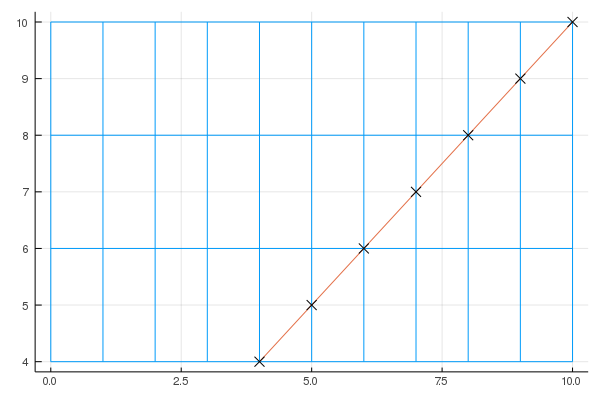

# VoxelRayTracers

[](https://jw3126.github.io/VoxelRayTracers.jl/stable)
[](https://jw3126.github.io/VoxelRayTracers.jl/dev)
[](https://travis-ci.com/jw3126/VoxelRayTracers.jl)
[](https://codecov.io/gh/jw3126/VoxelRayTracers.jl)

# Usage

```julia
using VoxelRayTracers

edges = (0:1:10, 4:2:10,)
ray = (position=[0,0], velocity=[1,1])
for hit in eachtraversal(ray, edges)
    println(hit)
end
```
```
(voxelindex = CartesianIndex(5, 1), entry_time = 4.0, exit_time = 5.0)
(voxelindex = CartesianIndex(6, 1), entry_time = 5.0, exit_time = 6.0)
(voxelindex = CartesianIndex(7, 2), entry_time = 6.0, exit_time = 7.0)
(voxelindex = CartesianIndex(8, 2), entry_time = 7.0, exit_time = 8.0)
(voxelindex = CartesianIndex(9, 3), entry_time = 8.0, exit_time = 9.0)
(voxelindex = CartesianIndex(10, 3), entry_time = 9.0, exit_time = 10.0)
```
There is also some basic visualization useful for debugging:
```julia
using Plots
plot(eachtraversal(ray, edges))
```


# Design goals

* Lightweight, simple and fun
* Support arbitrary dimension and non uniform grids
* Reasonable performance
